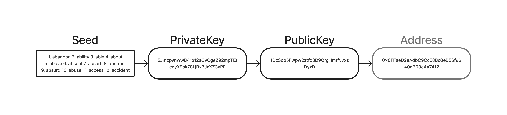
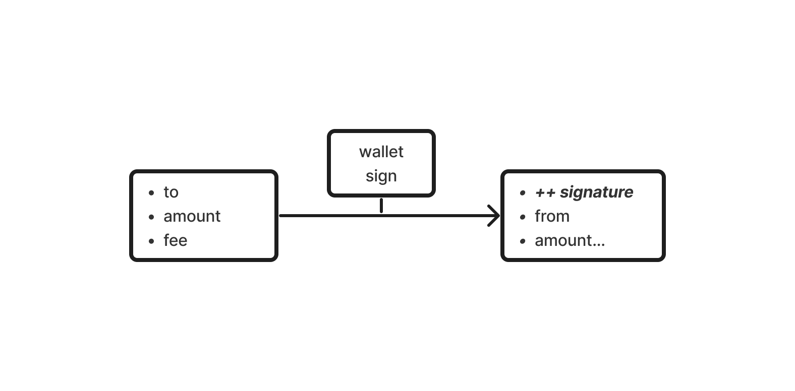
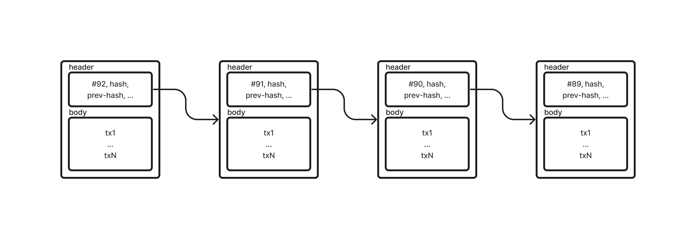
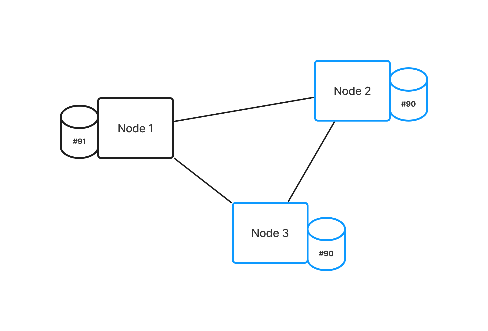
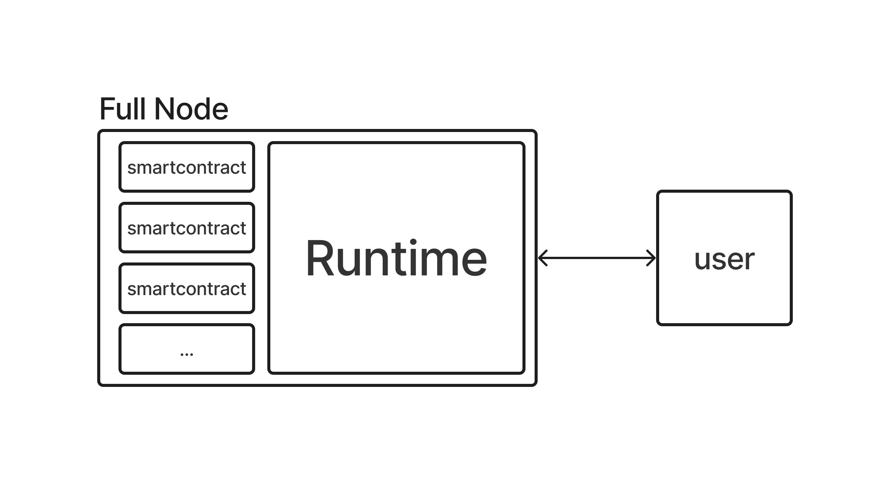
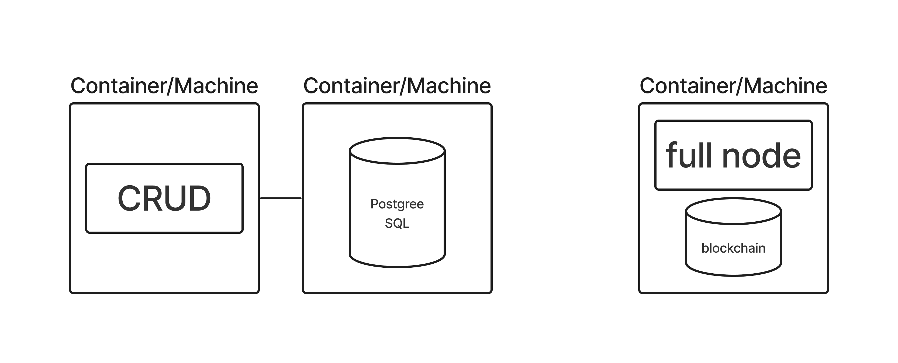
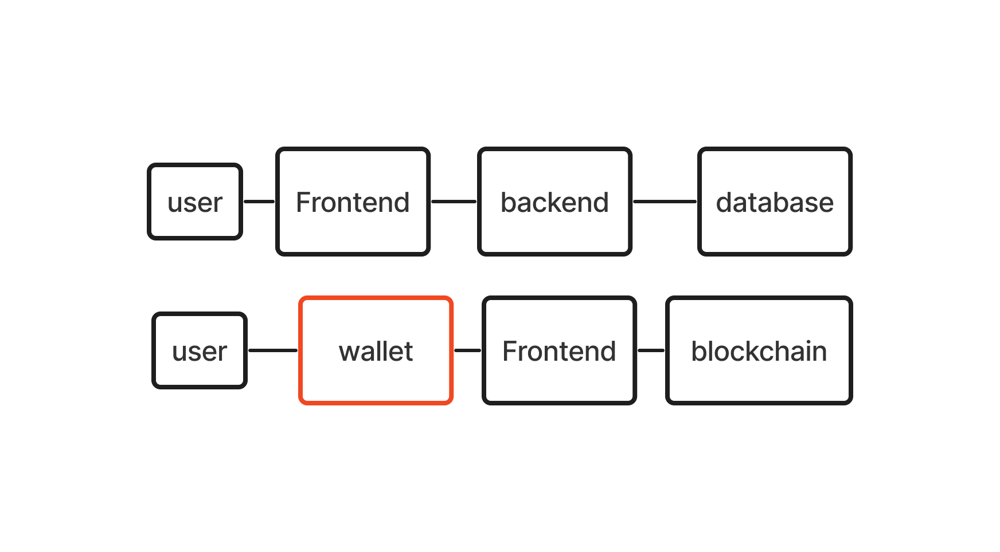
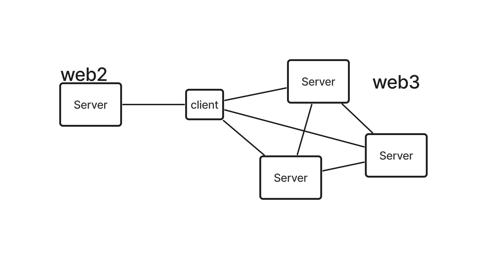
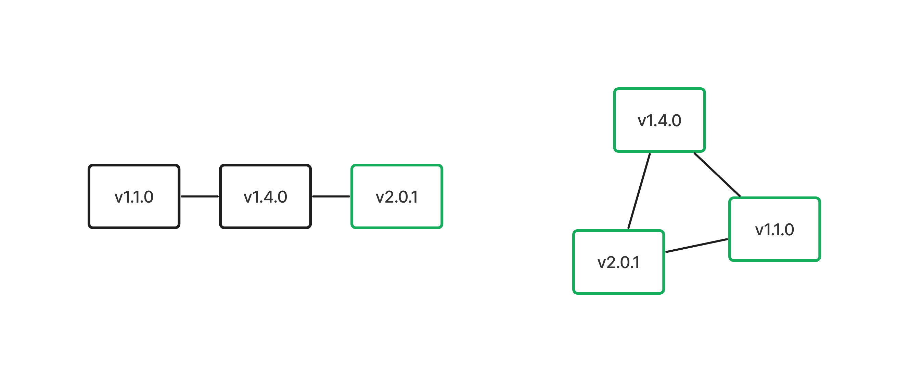
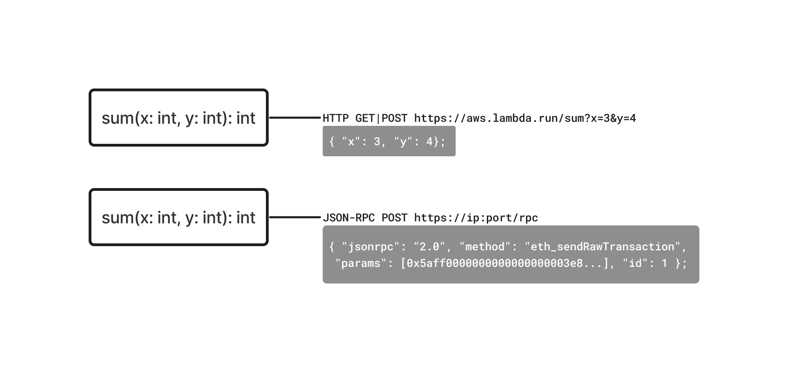

# Template de Estudo de Blockchains

1. Low-level
2. High-level

## Low-level

- Wallets
- Transações (tx)
- Blocos
- Consenso
- Smartcontracts

---

### Wallets

- Definição: O que são wallets.
- Tipos de Wallets: Hardware, software, paper, etc.
- Com funcionam:
  1. Criar Seed
  2. Transformar Seed em PrivateKey
  3. Calcular PublicKey pela PrivateKey
  4. Resumir a PublicKey em um Address (opcional)

---

### Transações (Tx)

- Definição: O que são transações nesta blockchain.
- Componentes: Account-based Model, from, to, amount, fee, signature
- Como funcionam:
  1. Adicionar PublicKey do destinário (wallet ou smartcontract)
  2. Adicionar quantidade de token ou chamada do smartcontract (serializada)
  3. Serializar Tx
  4. Assinar Tx
  5. Enviar para o Node

---

### Blocos

- Definição: O que são blocos.
- Componentes: Cabeçalho, Corpo e Transações.
- Como funciona:
  1. Recebe e valida a transação
  2. Adciona no Mempool
  3. Agrega as transações em um bloco

---

### Consenso

- Definição: O que é o mecanismo de consenso.
- Componentes: Proof of Work, Proof of Stake, SCP.
- Com funciona:
  1. Minera o bloco e transmite para os outros nodes
     1. O processo de mineração vária pra cada protocolo de consenso
  2. Caso receba o bloco durante a mineração
     1. Valida o bloco
     2. Adiciona na cadeia de blocos

---

### Smartcontracts

- Definição: O que é o mecanismo de consenso.
- Componentes: Solidity (EVM) e Rust (Wasm)
- Com funciona:
  1. Desenvolvimento do smartcontract
     1. Compilação e serialização
     2. Montar uma tx e assinatura
     3. Envio da tx
  2. Interação com smartcontract
     1. Montar a chamada e serializar
     2. Se for uma chamada para operação de escrita
        1. Assinar a tx
        2. Enviar a tx
     3. Se for uma chamada para operação de leitura simples request

## High-level 
### Comparação com CRUD

- Banco de dados
- Autenticação
- Rede
- Versionamento
- Serveless

---

### Comparação sobre Banco de dados

- Banco embarcado x Banco servidor
- CRUD sem Delete
- Estrutura do banco como Linked-list
- Persistencia em lots (blocos)

---

### Comparação sobre autenticação

- email, senha + token vs chave privada, chave pública + assinatura

---

### Comparação sobre rede

- Redundancia e LoadBalancer
- Sincronização dos nodes

---

### Comparação sobre Versionamento

- CI/CD vs Deploy decentralizado
- CI/CD vs Smartcontracts

---

### Comparação sobre serveless

- Roteamento vs Endereços + calldata
- Centralização vs Decentralização

## Resumo da Aula

- low-level
- high-level

## Próxima aula: Noções Históricas
