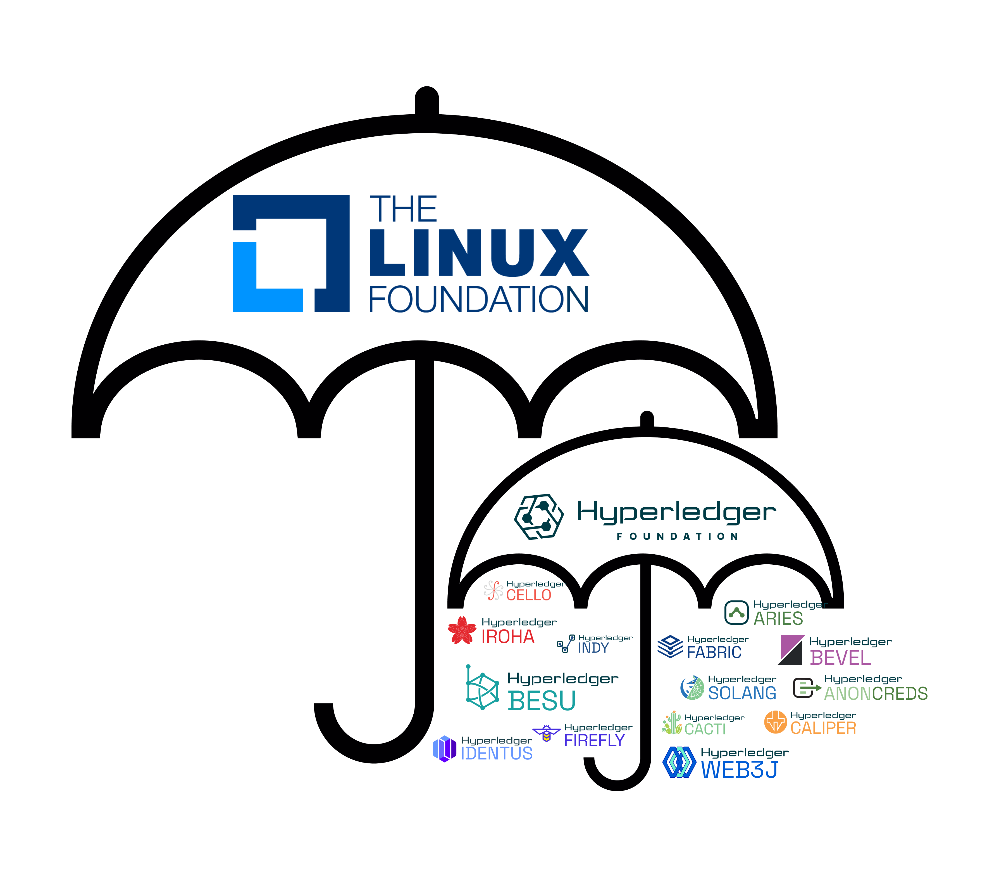

# Análise Hyperledger Besu

- O que é a hyperledger?
- Arquitetura do Hyperledger Besu
- Wallet, Tx, Bloco, Consenso, Smartcontracts
- O que é Metamask
- Arquitetura Metamask + Besu
- Instalar Metamask

## Introdução

Bem-vindos à aula sobre blockchain!

Hoje vamos explorar o que é a Hyperledger, a arquitetura do Hyperledger Besu e seus conceitos fundamentais como Wallet, Transação, Bloco, Consenso e Smart Contracts, além disso vamos aprender sobre a wallet Metamask, como instalar e configurar ela no seu navegador, pois ela será útil.

## O que é a Hyperledger?

Hyperledger é uma fundação e parafraseano o que está no site: "É um ecossistema aberto e global para tecnologias de blockchain de nível corporativo.
Como um projeto da Linux Foundation, a Hyperledger Foundation coordena uma comunidade de organizações, membros e não membros, contribuintes individuais e programadores que criam plataformas, bibliotecas, ferramentas e soluções de nível corporativo para sistemas que utilizam técnologias de registro distribuído (DLT) como blockchain e outras técnologias relacionadas."

Alguns dos projetos incubados por eles são:

- Hyperledger Fabric para redes permissionadas
- Hyperledger Besu, que é compatível com a rede Ethereum e é o case do DREX
- Hyperledger Indy focado em Identidade Digital Decentralizada

Entre outros...

---

## Arquitetura do Hyperledger Besu

- **Imagem Sugerida:** Diagrama da arquitetura do Besu

Hyperledger Besu é um cliente Ethereum criado para ambientes corporativos e suporta tanto redes permissionadas quanto públicas.
Principais componentes incluem vários protocolos de consenso, a Ethereum Virtual Machine (EVM), e APIs para interação com a rede.

## Conceitos Fundamentais

- **Wallet:** Hash e curvas elipticas
- **Transações:** Padrões de tx compativeis com Ethereum
- **Bloco:** Tamanho do bloco, tempo de bloco...
- **Consenso:** Tipos de consenso que o hyperledger besu suporta
- **Smart Contracts:** Versões de EVM suportadas

## O que é Metamask?

Metamask é uma extensão de navegador que funciona como uma carteira digital para Ethereum e outras redes compatíveis. Permite a interação fácil com dApps (aplicações descentralizadas).
Com Metamask, você pode gerenciar chaves, contas, enviar e receber transações, e conectar-se a diversas dApps.

## Arquitetura Metamask + Besu

Metamask pode se conectar a redes baseadas em Ethereum, como o Hyperledger Besu. Isso permite interações fluidas com contratos e transações na rede Besu.
Para conectar Metamask ao Besu, é necessário adicionar a rede Besu nas configurações do Metamask com os dados específicos da rede.
Metamask pode ser instalado como extensão no Chrome, Firefox ou Brave. Vamos seguir os passos de instalação.
Após a instalação, configure sua wallet, crie uma nova conta ou importe uma existente, e anote sua seed phrase com segurança.

## Conclusão

Hoje exploramos o Hyperledger e Besu, conceitos fundamentais de blockchain, Metamask, e como conectar Metamask ao Besu. Alguma dúvida ou pergunta?
